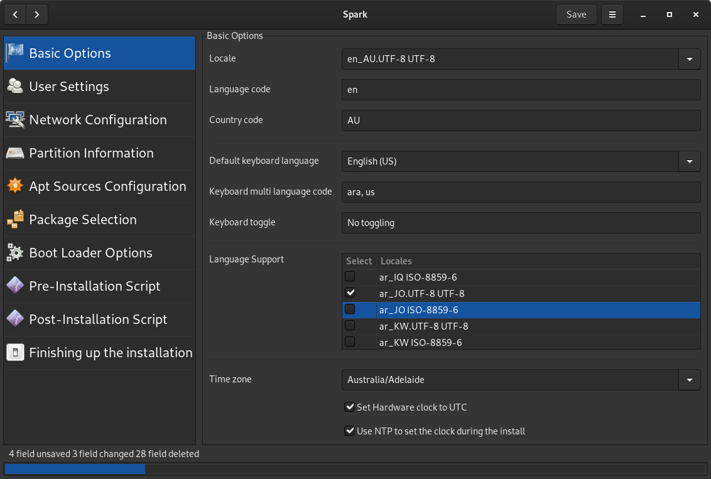

# Spark
A simple graphical tool for creating preseed files, for Debian GNU/Linux.

The program requires the xorriso, install xorriso first:

	sudo apt-get install xorriso

And then to install Spark run:

	sudo python3 setup.py install --install-layout=deb --install-scripts=/usr/bin/ --record file.txt

Or run Spark without installing:

	./sparking
