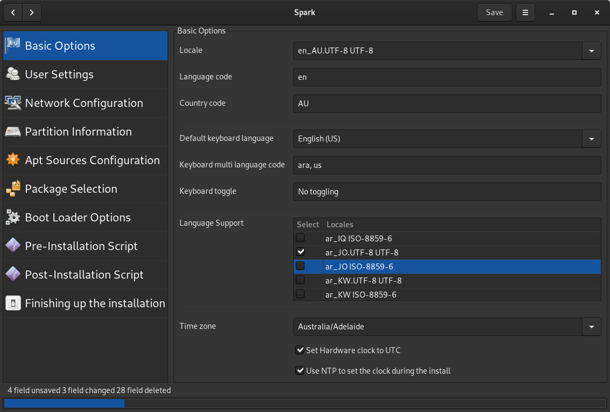

# spark
A simple graphical tool for creating preseed files, for Debian GNU/Linux
support Debian 10.X.X buster CD/DVD image, live image UNSUPPORTED

The program requires the xorriso install it first: 
sudo apt-get install xorriso

And then to install it run. 
sudo python3 setup.py install --install-layout=deb --install-scripts=/usr/bin/ --record files.txt

Or run it without installing 
./sparking

